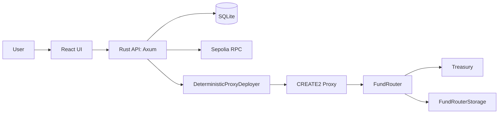
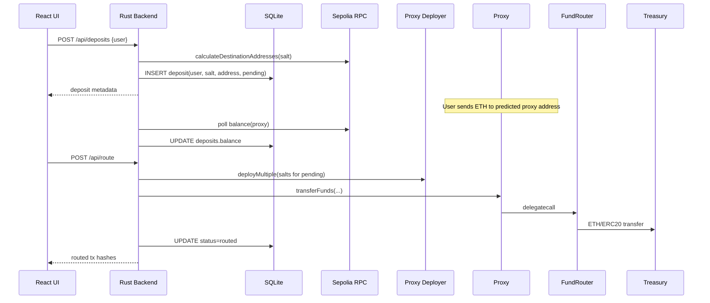

I built a small full-stack system for deterministic deposit addresses and automated treasury routing on Sepolia.

The core idea is simple:
- each user gets a deterministic proxy address (CREATE2),
- the app monitors those addresses for incoming ETH,
- once funded, the system routes value to a treasury through a permissioned router.

This post walks through the architecture, contract design, Rust backend, React UI, testing strategy, and deployment approach. Source code is on [GitHub](https://github.com/sergey-melnychuk/Of-Course-I-Knew-The-Address).

---

## Problem

A user should be able to see their deposit address immediately, without waiting for an on-chain transaction. Deterministic addresses make this possible:
- generate a destination address before deployment,
- share it immediately with users,
- deploy only when needed (or batch deploy later),
- keep address generation consistent across backend and on-chain logic.

An EVM address can receive ETH before any contract is deployed there. CREATE2 guarantees the address is deterministic, so the backend can predict it, share it, and deploy later — the funds will be waiting.

The challenge is making this practical end-to-end:
- contract side (CREATE2 + minimal proxies + permissions),
- backend side (address generation, persistence, monitoring, routing),
- frontend side (visibility and actions),
- deployment side (easy demo + reproducible environment).

---

## Architecture



### Main Flow



---

## Smart Contract Design

### 1) DeterministicProxyDeployer

I use OpenZeppelin `Clones` to deploy EIP-1167 minimal proxies and `cloneDeterministic` for CREATE2.

Key points:
- `_deriveSalt(userSalt, msg.sender)` prevents cross-caller salt collisions.
- `calculateDestinationAddresses` uses the same derivation logic as deployment.
- `predictDeterministicAddress` makes off-chain prediction and on-chain deployment align.

```solidity
function _deriveSalt(
    bytes32 userSalt,
    address caller
) internal pure returns (bytes32) {
    return keccak256(abi.encodePacked(userSalt, caller));
}

function calculateDestinationAddresses(
    bytes32[] calldata salts
) external view returns (address[] memory out) {
    out = new address[](salts.length);
    for (uint256 i = 0; i < salts.length; i++) {
        bytes32 salt = _deriveSalt(salts[i], msg.sender);
        out[i] = FUND_ROUTER_ADDRESS.predictDeterministicAddress(salt);
    }
}
```

### 2) FundRouter + FundRouterStorage

Each proxy is an EIP-1167 minimal proxy that `delegatecall`s into `FundRouter`. This means inside `transferFunds`, `address(this)` refers to the *proxy* — which is where the deposited funds actually live. The router implementation is shared, but each proxy operates on its own balance. The proxy also has `receive() external payable {}`, so it can accept plain ETH transfers before or after deployment.

`FundRouter` routes ETH and optional ERC20s, gated by storage permissions:
- `isAllowedCaller(msg.sender)` must be true,
- `isAllowedTreasury(treasury)` must be true,
- token and amount arrays must match.

`FundRouterStorage` is intentionally tiny and owner-controlled:
- permission bits: `0x01` caller, `0x02` treasury.

Why this split:
- router logic remains focused on transfer behavior,
- permission policy is isolated and replaceable,
- iterating on permissions doesn't require redeploying the router or re-creating proxies.

```solidity
// FundRouterStorage — bitmask permission checks
function isAllowedCaller(address who) public view returns (bool) {
    return (permissions[who] & 0x01) == 0x01;
}

function isAllowedTreasury(address who) public view returns (bool) {
    return (permissions[who] & 0x02) == 0x02;
}
```

```solidity
// FundRouter — routing with permission gates
function transferFunds(
    uint256 etherAmount,
    address[] calldata tokens,
    uint256[] calldata amounts,
    address payable treasuryAddress
) external override {
    if (treasuryAddress == address(0)) revert ZeroTreasury();
    if (!STORAGE.isAllowedCaller(msg.sender)) revert NotAuthorizedCaller();
    if (!STORAGE.isAllowedTreasury(treasuryAddress))
        revert TreasuryNotAllowed();
    if (tokens.length != amounts.length) revert LengthMismatch();

    if (etherAmount > 0) {
        (bool ok, ) = treasuryAddress.call{value: etherAmount}("");
        if (!ok) revert EthSendFailed();
    }

    for (uint256 i = 0; i < tokens.length; i++) {
        uint256 amt = amounts[i];
        if (amt == 0) continue;
        bool ok = IERC20(tokens[i]).transfer(treasuryAddress, amt);
        if (!ok) revert Erc20TransferFailed();
    }
}
```

A note on the ETH transfer: `.call{value:}` is used instead of `.transfer()` because the latter forwards only 2300 gas, which can fail if the treasury is a contract with a non-trivial `receive()`. The trade-off is reentrancy exposure — but here the caller is already permissioned, and the function performs no state changes after the external call that an attacker could exploit.

---

## Rust Backend Design

### Contract Bindings

The backend uses [alloy](https://github.com/alloy-rs/alloy) with the `sol!` macro to generate type-safe Rust bindings directly from Solidity interfaces:

```rust
sol! {
    #[sol(rpc)]
    interface IDeterministicProxyDeployer {
        function calculateDestinationAddresses(
            bytes32[] calldata salts
        ) external view returns (address[] memory);

        function deployMultiple(
            bytes32[] calldata salts
        ) external returns (address[] memory);
    }
}
```

This gives typed method calls (`deployer.calculateDestinationAddresses(salts).call().await?`) instead of hand-encoding ABI payloads.

### API Surface

- `POST /api/deposits`
  - validates user address hex
  - computes salt (`keccak256(user)`)
  - predicts proxy address from deployed contract
  - stores row as `pending`
- `GET /api/deposits`
  - filter by user/salt/address/status
  - paging via `limit/offset`
- `POST /api/route`
  - two-phase routing (see below)

### Routing: Two-Phase Workflow

The `POST /api/route` endpoint executes a two-phase process:

**Phase 1 — Deploy.** Collect all `pending` deposits, filter out those whose proxy already has code on-chain, and batch-deploy the rest:

```rust
let mut non_proxies = Vec::new();
for (address, salt) in predicted.into_iter().zip(salts.into_iter()) {
    let code = provider.get_code_at(address).await?;
    if code.is_empty() {
        non_proxies.push(salt);
    }
}
```

This makes deployment idempotent — re-running route on partially deployed deposits won't revert.

**Phase 2 — Sweep.** Each deposit is mapped to an async closure that calls `route_funds` and updates the DB row, then all closures run concurrently via `try_join_all`:

```rust
let txs = futures::future::try_join_all(
    deposits.into_iter().map(|deposit| {
        let state = state.clone();
        async move {
            eth::route_funds(/* proxy, treasury */).await
        }
    })
).await?;
```

The fan-out is concurrent but not batched — works fine for dozens of deposits but would need a proper job queue at scale.

### Persistence Model

SQLite table stores:
- `user` (20-byte blob),
- `salt` (32-byte unique blob),
- `address` (20-byte unique blob),
- `status` (`pending`/`proxied`/`routed`),
- `balance` (32-byte blob, nullable),
- timestamps.

Addresses and salts are stored as fixed-length BLOBs with `CHECK(length(...))` constraints, not hex strings. This keeps storage compact and avoids case-sensitivity issues with hex comparisons.

### Monitoring Loop

A background task polls balances every `POLL_BALANCE_DELAY` seconds and updates `balance`.

```rust
async fn poll_balances(state: Arc<AppState>) -> anyhow::Result<()> {
    let filters = db::DepositFilters {
        status: vec!["pending".to_string(), "proxied".to_string()],
        ..Default::default()
    };

    let deposits = db::query_deposits(&state.db, &filters).await?;
    let mut tx = state.db.begin().await?;

    for deposit in deposits {
        if let Ok(balance) = eth::get_balance(
            &state.config.sepolia_rpc_url,
            Address::from_slice(&deposit.address),
        )
        .await
        {
            sqlx::query("UPDATE deposits SET balance = ? WHERE id = ?")
                .bind(&balance[..])
                .bind(deposit.id)
                .execute(&mut *tx)
                .await?;
        }
    }
    tx.commit().await?;
    Ok(())
}
```

---

## Frontend Design

The frontend is a single-page operational dashboard: inline filtering (status/user/address), paging, refresh controls, per-row actions (`Deploy`/`Route`), error modal and copy-to-clipboard.

One detail worth highlighting — the `weiToEth` conversion uses `BigInt` to avoid floating-point precision loss:

```typescript
export function weiToEth(hexWei: string): string {
  const raw = hexWei.startsWith("0x") ? hexWei.slice(2) : hexWei;
  if (!raw || /^0+$/i.test(raw)) return "0";
  const wei = BigInt("0x" + raw);
  const div = BigInt(10) ** BigInt(18);
  const int = wei / div;
  const frac = (wei % div).toString().padStart(18, "0").replace(/0+$/, "");
  if (!frac) return int.toString();
  const decimals = frac.slice(0, 6);
  return `${int}.${decimals}`;
}
```

ETH balances are 256-bit integers. `Number` loses precision beyond 2^53, which is about 0.009 ETH in wei — well within realistic deposit amounts. `BigInt` division and modulo give exact results, then string formatting handles the decimal point and trailing zeros.

---

## Testing Strategy

Tests cover all three layers:

- **Contracts** (Hardhat + Chai, 18 tests) — permission checks, deterministic prediction, multi-deploy, duplicate salt rejection, end-to-end deploy+fund+route.
- **Backend** (Rust unit tests) — hex decode/encode/validation, keccak256 known vectors, roundtrip determinism.
- **Frontend** (Vitest + Testing Library) — `weiToEth` formatting edge cases, initial fetch rendering, create-deposit payload, error modal path.

The most interesting contract test is the end-to-end flow — predict a proxy address, deploy it, fund it with ETH, then route through the proxy to treasury:

```javascript
it("end-to-end: deploy proxy, fund it, route to treasury", async function () {
    const salt = ethers.keccak256(ethers.toUtf8Bytes("e2e-salt"));

    const [proxyAddr] = await deployer
        .connect(caller).calculateDestinationAddresses([salt]);
    await deployer.connect(caller).deployMultiple([salt]);

    await caller.sendTransaction({
        to: proxyAddr, value: ethers.parseEther("0.5") });

    await storage.setPermissions(caller.address, 0x01);

    // Call transferFunds on the proxy (delegatecalls to FundRouter)
    const routerAbi =
        (await ethers.getContractFactory("FundRouter")).interface;
    const proxyAsRouter =
        new ethers.Contract(proxyAddr, routerAbi, caller);

    await proxyAsRouter.transferFunds(
      ethers.parseEther("0.5"), [], [], treasury.address);

    expect(await ethers.provider.getBalance(proxyAddr)).to.equal(0);
});
```

Note `new ethers.Contract(proxyAddr, routerAbi, caller)` — the test calls the *proxy* address using the *router* ABI, which is exactly how delegatecall proxies work. The proxy has no ABI of its own; it just forwards everything to the implementation.

Another test verifies caller isolation — the same salt produces different addresses for different callers, thanks to `_deriveSalt`:

```javascript
const [addr1] = await deployer.connect(caller)
    .calculateDestinationAddresses([salt]);
const [addr2] = await deployer.connect(treasury)
    .calculateDestinationAddresses([salt]);
expect(addr1).to.not.equal(addr2);
```

Project-level command:

```bash
make test
```

---

## Deployment Approach

I optimized for one-command demo deployment:

- multi-stage Docker build:
  1. compile contracts,
  2. build frontend (Vite produces a single `index.html` via `vite-plugin-singlefile`),
  3. compile Rust backend,
  4. run as a compact runtime image.
- frontend static output is embedded into the Rust binary via `include_str!` and served directly — no separate static file server or reverse proxy needed.
- deployment works on a clean Ubuntu/DigitalOcean instance with `docker compose up -d --build`.

One practical trick: the Rust `build.rs` creates a fallback `index.html` if the frontend hasn't been built yet, so `include_str!` doesn't break during backend-only development:

```rust
let index = std::path::Path::new("../app/dist/index.html");
if !index.exists() {
    if let Some(parent) = index.parent() {
        std::fs::create_dir_all(parent).ok();
    }
    std::fs::write(index,
        "<html><body><p>Frontend not built.</p></body></html>",
    ).ok();
}
```

I also used a fast path for low-powered VMs:
- build image locally for `linux/amd64`,
- `docker save | gzip`,
- upload tarball,
- `docker load` on the VM.

---

## Real Chain Validation (Sepolia)

I validated the system with actual Sepolia deployments and routing.

Deployed contracts:
- [FundRouterStorage](https://sepolia.etherscan.io/address/0x67979DE8C2F18FcC405415432000f7231AA8F12C)
- [FundRouter](https://sepolia.etherscan.io/address/0xD0d0F17Db168A74d6cb924F40cF062Fa40C857da)
- [DeterministicProxyDeployer](https://sepolia.etherscan.io/address/0x576a15Ff748b6F9BE74E7666E1A7c717AF096e5E)
- [Sample proxy](https://sepolia.etherscan.io/address/0xe24d719914b9e6bcfc95afe7ad8fd11ccbe6a101)
- [Sample route tx](https://sepolia.etherscan.io/tx/0xf4ca415a47f5500d6f6e1ebd7bb9cd4ae2d04a1e499d92173085fbc2857685da)

The important verification:
- predicted proxy address matched deployed proxy address,
- funded proxy value was routed to treasury,
- dashboard status transitioned `pending -> proxied -> routed`.

---

## Takeaways

The key design decision was making the on-chain contract the single source of truth for address prediction. The Rust backend calls `calculateDestinationAddresses` on the deployed contract rather than reimplementing CREATE2 derivation off-chain, so there's no risk of the two diverging. You could hand-craft proxy bytecode and replicate the address derivation in Rust — but that's working hard, not smart. One implementation to get right, not two to keep in sync.

The `delegatecall` proxy pattern was the most subtle part to get right. It's easy to forget that `address(this)` inside a delegatecall refers to the proxy, not the implementation — which is exactly what makes fund sweeping work (the balance lives at the proxy address), but also means any state variables in the implementation would collide with the proxy's storage. Keeping `FundRouter` stateless and reading permissions from an external `FundRouterStorage` contract avoids this entirely.

If I were to revisit this, I'd spend more time on the routing step — the `try_join_all` fan-out works for dozens of deposits but doesn't handle partial failures gracefully. A proper job queue with retry semantics and per-deposit error tracking would be the natural next step.
