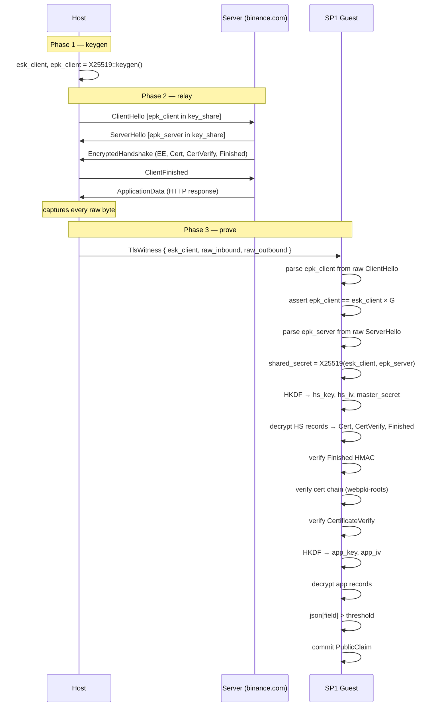

TL/DR: [sp1-demo](https://github.com/sergey-melnychuk/sp1-demo) — a zero-knowledge proof that a JSON field fetched over HTTPS exceeds a threshold. The server's TLS certificate is the trust anchor. The prover runs on the user's own machine.

---

This started as a simple question: can you prove that a server said something — not that *you* say the server said it, but that it cryptographically must have — without anyone needing to trust you?

The short answer is: it depends on who "you" is. Working through the two iterations made that clear.

### The problem

Say you want to prove to a third party that your Binance balance is above $X. You could send them a screenshot, but screenshots are trivially faked. You could ask Binance to issue a signed statement, but Binance is not going to build an attestation API for every use case. You could use a trusted oracle, but that just shifts the trust to the oracle operator.

What you actually want is: "I made a real HTTPS request to `binance.com`, the server responded with a JSON body containing `balance > X`, and here is a proof that cannot be faked without breaking TLS."

TLS 1.3 has the right structure for this. The `CertificateVerify` message is the server signing the entire handshake transcript with its private key. If you can verify that signature inside a ZK circuit, you get an unforgeable proof that the real `binance.com` server participated in this exact handshake.

### Iteration 1: the naive approach

The first version worked like this:

1. The host opens a TLS 1.3 connection, captures session secrets via a custom `KeyLogWriter`.
2. The host uses those secrets to derive `server_write_key` and decrypt the server's messages.
3. The host passes parsed, already-decrypted data to the SP1 guest: cert chain, `CertificateVerify` signature, plaintext HTTP body.
4. The guest verifies signatures and evaluates the JSON predicate.

```
┌───────────────────────────────────────────┐
│  HOST                                     │
│                                           │
│  rustls connection                        │
│    ↓ KeyLogWriter captures session secret │
│  derive server_write_key                  │
│  decrypt records                          │
│  parse: certs, CertVerify, plaintext      │
│    ↓ pass parsed data                     │
└───────────────────────────────────────────┘
                    │
                    ▼
┌───────────────────────────────────────────┐
│  GUEST                                    │
│                                           │
│  verify cert chain                        │
│  verify CertificateVerify signature       │
│  evaluate json[field] > threshold         │
│  commit PublicClaim                       │
└───────────────────────────────────────────┘
```

This worked end-to-end. And then I thought harder about what it actually proves.

### The trust hole

The guest verifies what the host gave it. The host decrypted the records and passed the plaintext. But if the host can decrypt, it can also *re-encrypt* arbitrary content with `server_write_key` and pass that as the response instead.

`CertificateVerify` doesn't help here. The host passed a real cert and a real signature — but it also passed a plaintext body that it *claimed* came from that session. The two aren't cryptographically linked. A malicious host can present a real cert for `binance.com` and a fabricated balance. The guest verifies them independently and cannot tell they came from different places.

### Iteration 2: move the key schedule into the guest

The obvious fix: don't give the host parsed data. Give it only raw bytes and let the guest derive everything itself.



The guest now runs the full TLS 1.3 key schedule from scratch: X25519, HKDF, handshake decryption, cert chain verification, `CertificateVerify`, app record decryption — all in-circuit. About 20 million SP1 cycles. The guest also asserts that `epk_client` in the raw `ClientHello` matches `esk_client × G`:

```rust
let epk_client_wire = parse_client_hello_key_share(&witness.raw_outbound)
    .expect("epk_client in ClientHello");

let epk_derived = PublicKey::from(&StaticSecret::from(witness.esk_client));
assert_eq!(epk_derived.as_bytes(), &epk_client_wire);
```

This ties the proof to the specific ephemeral key used in the handshake. The server's `CertificateVerify` signs the transcript including `epk_client`, so the guest proves the real server signed a handshake with this exact key.

### The gap that remains

Here's where it gets honest. The host generates `esk_client` in phase 1 and passes it to the guest in phase 3. The host also holds `raw_inbound`, which contains `epk_server` in the raw `ServerHello`. That means the host can compute:

```
shared_secret    = X25519(esk_client, epk_server)   // trivial
server_write_key = HKDF(...)                         // fifteen lines
```

A forging host can then:

1. Make a real connection to `binance.com`, get a real cert and real `CertificateVerify`.
2. Compute `server_write_key` from `esk_client` + `epk_server`.
3. Encrypt a fabricated HTTP response with the correct AES-GCM nonces.
4. Substitute the forged application-data records into `raw_inbound`.
5. Feed that to the guest. The guest decrypts successfully (right key, right nonces), verifies the real cert and `CertificateVerify`, evaluates the fake JSON, and commits a lie.

The `epk_client == esk_client × G` check doesn't help because the host supplied `esk_client` — it can pass any consistent pair. The AES-GCM authentication doesn't help because the host knows the key.

The `CertificateVerify` covers the handshake transcript. The application data is not part of that transcript. Those two things are verified in-circuit but they're not cryptographically linked to each other.

### What the proof actually provides

The guest code is correct. The circuit is sound. What it proves is: *given this witness, the TLS session is cryptographically valid and the JSON field exceeds the threshold*. What it cannot prove is that the witness wasn't constructed by the prover.

That distinction matters if the prover is a separate party from the user. It doesn't matter if the prover is the user — nobody forges their own bank balance to prove it to themselves. So the design is honest for **self-proving**: the user runs the prover on their own machine, makes a real request, and produces a proof for a third party. The user has the data anyway; the proof just lets them attest to it without sharing the full response.

The gap only bites in delegated proving — where a third party runs the prover on your behalf. Closing it in software requires splitting the session key so the prover never holds it whole. That's a different project.

### The TLS key schedule, in the guest

This is the part that felt most satisfying to implement. TLS 1.3's HKDF key schedule (RFC 8446 §7.1) is about fifteen lines of `HKDF-Extract` and `HKDF-Expand-Label` calls:

```rust
let shared_secret = x25519(esk_client, epk_server);

let early_secret = hkdf_extract(&[0u8; 32], &[0u8; 32]);
let derived1 = expand_label(&early_secret, "derived", &sha256(b""), 32);
let hs_secret = hkdf_extract(&derived1, &shared_secret);

let server_hs_secret = expand_label(&hs_secret, "s hs traffic", &transcript_after_sh, 32);
let hs_key = expand_label(&server_hs_secret, "key", b"", 16);
let hs_iv  = expand_label(&server_hs_secret, "iv",  b"", 12);

let derived2 = expand_label(&hs_secret, "derived", &sha256(b""), 32);
let master_secret = hkdf_extract(&derived2, &[0u8; 32]);

let server_app_secret = expand_label(&master_secret, "s ap traffic", &transcript_after_fin, 32);
let app_key = expand_label(&server_app_secret, "key", b"", 16);
let app_iv  = expand_label(&server_app_secret, "iv",  b"", 12);
```

The transcript hashes (`transcript_after_sh`, `transcript_after_fin`) are computed in-guest by SHA-256 hashing the raw handshake messages in order. The transcript includes every parsed message, so the guest is committing to the exact sequence of bytes the server sent.

Record decryption uses the constructed `(key, iv)` pair with a per-record sequence number:

```rust
let nonce: [u8; 12] = {
    let mut n = app_iv;
    let seq_be = (seq as u64).to_be_bytes();
    for i in 0..8 {
        n[4 + i] ^= seq_be[i]; // iv XOR seq
    }
    n
};
let plaintext = aes_128_gcm_decrypt(&app_key, &nonce, &aad, ciphertext)?;
```

Middle-record omission is caught for free: skipping a record shifts all subsequent sequence numbers, every nonce is wrong, AES-GCM authentication fails. Tail-record omission requires an explicit HTTP response completeness check — that part is still open (see the repo's `NEXT.md`).

### Parsing `key_share` from raw ClientHello

This was the fiddliest part. The `key_share` extension in `ClientHello` is a list of `KeyShareEntry` records; `ServerHello` has a single `KeyShareEntry`. There is no existing pure-Rust TLS parser that runs inside a zkVM (ring dependencies, async, etc.), so the guest parses the extensions by hand:

```rust
fn parse_client_hello_key_share(outbound: &[u8]) -> Option<[u8; 32]> {
    // TLS record header: type(1) + version(2) + length(2)
    // Handshake header:  type(1) + length(3)
    // ClientHello body:  legacy_version(2) + client_random(32) + session_id(1+N)
    //                    + cipher_suites(2+M) + compression(1+L) + extensions(2+...)
    // In extensions, scan for type 0x0033 (key_share)
    // key_share client: list_len(2), then entries: { group(2), klen(2), key(klen) }
    // Find group 0x001d (X25519), klen == 32
    ...
}
```

The format is straightforward once you have RFC 8446 §4.2.8 open. The guest does the same thing for `ServerHello` where the extension contains a single `KeyShareEntry` rather than a list.

### SP1 precompiles and the RSA version trap

SP1 provides hardware-accelerated precompiles for several primitives. The ones that matter here:

| Primitive | Crate | Accelerated |
|---|---|---|
| X25519 | `x25519-dalek` | ✅ |
| SHA-256 | `sha2` | ✅ |
| P-256 ECDSA | `p256` | ✅ |
| RSA verify | `rsa` | ✅ — but only `=0.9.6` |
| AES-128-GCM | `aes-gcm` | ❌ software |

The RSA one has a gotcha. The workspace `Cargo.toml` patches `rsa = "0.9.6"` with the accelerated version, but `crates.io` resolves `rsa = "0.9"` to `0.9.10`. The patch silently does not apply. You need to pin explicitly in `program/Cargo.toml`:

```toml
rsa = { version = "=0.9.6", default-features = false, features = ["sha2"] }
```

Without this pin, `blockchain.info` (RSA cert) runs fine but takes 10× as many cycles. The build output contains a warning — "patch for rsa was not used in the crate graph" — but it is easy to miss.

### What the proof actually guarantees

The public outputs are:

```rust
pub struct PublicClaim {
    pub host: String,       // "blockchain.info"
    pub field: String,      // "/USD/last"
    pub threshold: f64,
    pub value: f64,
}
```

What the guest proves, given the witness:

- The hostname matches a certificate that chains to Mozilla root CAs.
- The real server signed a transcript that includes `epk_client` (`CertificateVerify`).
- The decrypted, AES-GCM-authenticated application data contains `json[field] > threshold`.

What the proof cannot establish:

- **Witness authenticity.** The host knows `esk_client` and `epk_server` and can derive `server_write_key`. A dishonest host can encrypt fabricated application-data records with the right key and nonces, feed them to the guest, and get a valid proof over fake data. `CertificateVerify` covers the handshake transcript only — application data is not part of it.
- **Freshness.** An old session replays indefinitely. Mitigation: assert a server-side timestamp field within an acceptable window.
- **Tail completeness.** The host can withhold the last N application-data records. Middle-record omission is caught by AES-GCM (wrong nonce → wrong tag); tail omission is not.
- **Precision.** `f64` loses precision beyond ~15 significant digits — wrong for financial values at satoshi scale.

### Running it

```bash
git clone https://github.com/sergey-melnychuk/sp1-demo
cd sp1-demo/program && cargo prove build && cd ..

# Execute (no proof, fast — ~20M cycles):
SP1_SKIP_PROGRAM_BUILD=1 cargo run --release -- \
  --url "https://blockchain.info/ticker" \
  --field "/USD/last" \
  --threshold 1000

# Mock proof (instant, structurally real):
SP1_SKIP_PROGRAM_BUILD=1 SP1_PROVER=mock cargo run --release -- \
  --url "https://blockchain.info/ticker" \
  --field "/USD/last" \
  --threshold 1000 \
  --prove
```

Real STARK proof requires ~32 GB RAM. Mock is identical structurally — same public claim, same verification flow, no real cryptography.

---

**Disclaimer:** This is a research demo, not an audited library. Do not use it in production. The open items (freshness, tail completeness, f64 precision, certificate revocation) are real limitations. The threat model is self-proving: the user runs the prover on their own machine and has no incentive to forge their own data.

Full code and design notes: [github.com/sergey-melnychuk/sp1-demo](https://github.com/sergey-melnychuk/sp1-demo)
